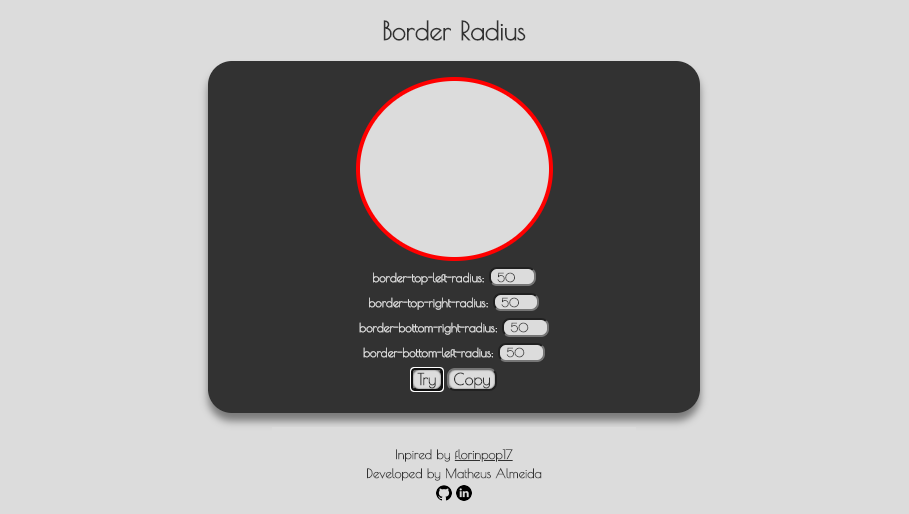

# Border-radius Previewer
> Preview how CSS3 border-radius values affect an element

# About this Project

The idea for this project came from the <a href="https://github.com/florinpop17/app-ideas" target="_blank">florinpop17</a> repository.

There are 80 ideas for better web development.

# Why?

This project is part of my personal portfolio and I would be very happy to receive feedback about the project, code, structure, anything that can make me a better developer!

E-mail: <a href="mailto:tthheusalmeida@gmail.com">tthheusalmeida@gmail.com</a>  
LinkedIn: <a href="https://www.linkedin.com/in/matheus-almeida-602139182/" target="_blank">matheus-almeida-602139182</a>

Also, you can use this project however you want, it is free to copy, change, improve ...

# Functionality

- After placing the values in the fields listed and pressing the "Try" button, it creates the preview of the border-radius.
- To receive the border-radius values, press the "Copy" button and you will be ready for the clipboard.

# How to use?

- <a href="https://help.github.com/en/github/creating-cloning-and-archiving-repositories/cloning-a-repository">Clone</a> this repository to your local machine using `https://github.com/tthheusalmeida/border-radius.git`
- Unzip the cloned file
- Open the `border-radius-master` folder
- Double click on the `index.html` file
- Enter the values corresponding to the border-radius fields
- Press Try button to preview border-radius
- Press Copy button to copy to clipboard 

# Note

- Border-radius values are copied in **%**, such as:  **border-radius: 0% 50% 0% 50%** 
- The minimum value that each element can assume is **0%**
- The maximum value that each element can assume is **50%**

# Built With

- <a href="https://html.spec.whatwg.org/multipage/">HTML</a> - Markup for page
- <a href="https://www.w3.org/Style/CSS/Overview.en.html">CSS</a> - Style for page
- <a href="http://www.ecmascript.org/">JavaScript</a> - Manipulation of page features

# License

- <a href="https://github.com/tthheusalmeida/border-radius/blob/master/LICENSE">MIT</a>
